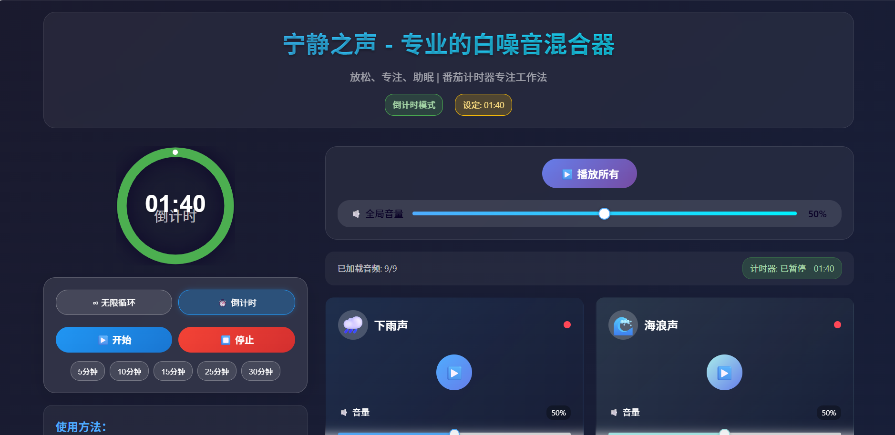
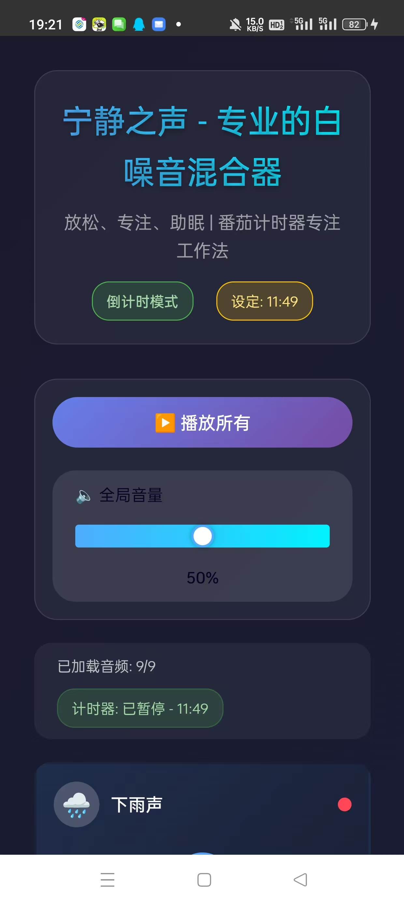

# Sound Mixer App

一个基于 Web 和移动端的音频混合工具，支持多轨道音频播放、音量调节和简单的音频效果处理。

## 功能特性

### Web 端
- **多轨道音频播放**：支持同时加载和播放多个音频文件。
- **音量调节**：每个音轨独立控制音量大小。
- **简单音频效果**：支持淡入淡出、循环播放等基本效果。
- **响应式设计**：适配不同屏幕尺寸的设备。

### 移动端（Android）
- **原生适配**：通过 HBuilderX 移植到移动端，支持 Android 设备。
- **离线使用**：支持本地音频文件加载和播放。
- **轻量级**：优化后的 APK 体积小，运行流畅。


## 项目截图




## 技术栈

### Web 端
- **前端**：Vue 3 + Composition API
- **样式**：CSS3 + Flexbox/Grid
- **音频处理**：Web Audio API
- **构建工具**：Vite

### 移动端
- **开发工具**：HBuilderX
- **打包格式**：Android APK
- **资源管理**：适配多分辨率图标和启动图。

## 快速开始

### Web 端
1. **安装依赖**：
   ```bash
   npm install
   ```
2. **启动开发服务器**：
   ```bash
   npm run dev
   ```
3. **构建生产版本**：
   ```bash
   npm run build
   ```

### 移动端
1. **安装 HBuilderX**：从[官网](https://www.dcloud.io/hbuilderx.html)下载并安装。
2. **导入项目**：打开 HBuilderX，导入 `soundmixer` 文件夹。
3. **运行调试**：连接 Android 设备或使用模拟器，点击运行。

## 项目结构

```
sound-mixer-app/
├── public/              # Web 端静态资源
├── src/                 # Web 端源代码
├── soundmixer/          # 移动端项目
│   ├── assets/          # 移动端资源
│   ├── unpackage/       # 打包输出（含 APK）
│   └── ...              # 其他移动端配置
├── vite.config.js       # Vite 配置
└── package.json         # 项目依赖和脚本
```

## 如何贡献
1. Fork 项目并克隆到本地。
2. 创建新分支：`git checkout -b feature/your-feature`。
3. 提交更改：`git commit -m "Add your feature"`。
4. 推送到远程分支：`git push origin feature/your-feature`。
5. 提交 Pull Request。

## 许可证
本项目采用 [MIT 许可证](LICENSE)。
